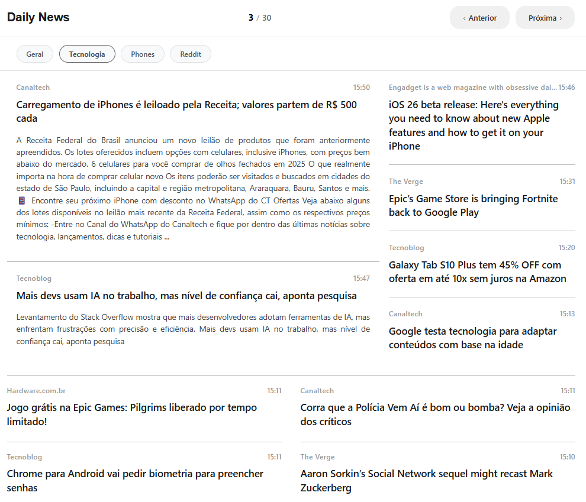
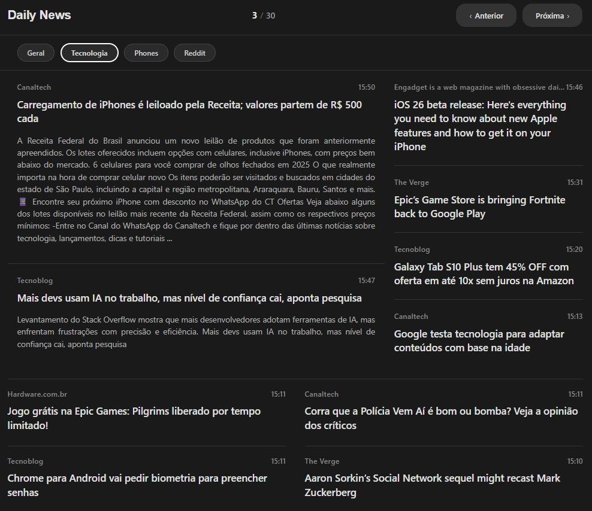

# 📰 Daily News - RSS News Aggregator


Um agregador RSS construído com SvelteKit 5. Organiza múltiplas fontes de notícias em categorias personalizáveis com interface limpa e responsiva. Possui ótima visualização no navegador experimental do Kindle.

> **📚 Importante**: Grande parte desse projeto foi desenvolvido utilizando IA generativa com o modelo Claude Sonnet 4 para geração de código. Ainda assim, devido as limitações da tecnologia generativa, algumas funcionalidades foram feitas no velho e bom modo de desenvolvimento, na mão.


## ✨ Características

- **🎯 Super Simples**: Projetado para ser extremamente fácil de instalar e usar localmente
- **📊 Multi-usuário**: Suporte a múltiplos perfis de usuário com configurações independentes
- **📂 Categorização**: Organizacao de feeds RSS em categorias personalizáveis
- **💾 Sem Banco de Dados**: Armazenamento de artigos em arquivos JSON para máxima simplicidade
- **📱 Responsivo**: Interface otimizada para desktop, tablet e mobile
- **🌙 Tema escuro/claro**: Alternância automática de tema com detecção de preferência
- **⚡ Tempo real**: Sincronização automática de notícias a cada 15 minutos
- **🎨 Design limpo**: Interface inspirada em leitores de notícias modernos
- **🐳 Docker**: Deploy simplificado com containers

### Interface Principal



### Tema Escuro



## 🛠️ Tecnologias

- **Frontend**: SvelteKit 5.x, TypeScript, Vite
- **Backend**: Node.js, XML parsing, Cron jobs
- **Deploy**: Docker, adaptador Node.js
- **Feeds**: Suporte RSS 2.0 e Atom 1.0

## 📋 Pré-requisitos

- Node.js 20+ ou Docker
- pnpm (recomendado) ou npm

## 🔧 Instalação

> 💡 **Recomendado**: Use as imagens pré-construídas do GHCR na seção [Deploy](#-deploy) para instalação mais rápida.

### Desenvolvimento Local

```bash
# Clone o repositório
git clone https://github.com/marcelomartins/daily-news.git
cd daily-news

# Instale as dependências
pnpm install

# Configure seus feeds RSS (veja seção Configuração)
cp data/exemplo.feeds data/seu-usuario.feeds

# Inicie o servidor de desenvolvimento
pnpm dev
```

### Docker

```bash
# Construa a imagem (após clonar o repositório)
docker build -t daily-news .

# Execute o container
docker run -d \
  --name daily-news \
  -p 3000:3000 \
  -v $(pwd)/data:/app/data \
  daily-news
```

## ⚙️ Configuração

### Configurando Feeds RSS

Crie um arquivo `.feeds` no diretório `data/` para cada usuário:

```bash
# data/usuario.feeds

[Geral]
https://g1.globo.com/rss/g1/brasil
https://g1.globo.com/rss/g1/mundo
https://folha.uol.com.br/rss/

[Tecnologia]
https://www.theverge.com/rss/index.xml
https://tecnoblog.net/feed/
https://canaltech.com.br/rss/

[Reddit]
https://www.reddit.com/r/selfhosted.rss#
https://www.reddit.com/r/technology.rss#
https://www.reddit.com/r/programming.rss#

```

#### Formato dos Feeds

- `[Categoria]`: Define uma nova categoria
- URLs RSS: Uma por linha
- `#`: Comentários (linha ignorada)
- URLs terminadas em `#`: Abre em nova janela

### Estrutura de Diretórios

```
data/
├── usuario.feeds              # Configuração de feeds do usuário
└── pages/
    ├── usuario-Geral-1.json      # Página 1 da categoria "Geral"
    ├── usuario-Geral-2.json      # Página 2 da categoria "Geral"
    ├── usuario-Tecnologia-1.json # Página 1 da categoria "Tecnologia"
    └── ...
```

## 🖥️ Uso

### Acessando a Aplicação

1. Visite `http://localhost:3000`
2. Será redirecionado para `/usuario` (primeiro usuário encontrado)
3. Navegue entre categorias usando a barra superior
4. Use os botões de navegação para percorrer as páginas

### URLs Disponíveis

- `/`: Redireciona para o primeiro usuário
- `/[usuario]`: Redireciona para a primeira categoria do usuário
- `/[usuario]/[categoria]`: Redireciona para a primeira página
- `/[usuario]/[categoria]/[pagina]`: Página específica

## 📁 Estrutura do Projeto

```
src/
├── app.html                   # Template HTML base
├── hooks.server.ts            # Hooks do servidor (tema)
├── lib/
│   ├── components/
│   │   ├── Article.svelte     # Componente de artigo
│   │   └── NavigationButtons.svelte  # Botões de navegação
│   └── server/
│       └── cron.js           # Sistema de cron e RSS parsing
└── routes/
    ├── +page.ts              # Redirecionamento raiz
    └── [user]/
        ├── +page.server.ts   # Lógica do usuário
        └── [category]/
            └── [[page]]/
                ├── +page.server.ts  # Carregamento de notícias
                └── +page.svelte     # Interface principal
```

## 🚀 Deploy

### Deploy Automatizado (GHCR)

O projeto possui GitHub Actions configurado para automaticamente:

- **Build**: Construir a imagem Docker multi-arquitetura (AMD64/ARM64)
- **Push**: Publicar no GitHub Container Registry (GHCR)
- **Tags**: Versionamento automático baseado em branches e tags

#### Triggers e Tags

| Trigger | Tags Criadas |
|---------|-------------|
| `push main` | `latest`, `main` |
| `push v1.2.3` | `v1.2.3`, `1.2`, `latest` |
| `pull request` | `pr-123` (não faz push) |

#### Configuração do GHCR

1. **Permissões**: GitHub Actions tem permissões automáticas para GHCR
2. **Visibilidade**: Por padrão pacotes são privados. Para tornar público:
   - Vá para "Packages" no repositório → `daily-news`
   - "Package settings" → "Change visibility" → "Public"

#### Imagens Disponíveis

- `ghcr.io/marcelomartins/daily-news:latest` - Última versão da branch principal
- `ghcr.io/marcelomartins/daily-news:v1.0.0` - Versões específicas
- `ghcr.io/marcelomartins/daily-news:main` - Branch principal

### Deploy com Docker

#### Docker Run Simples

```bash
# Última versão
docker run -d 
  --name daily-news 
  -p 3000:3000 
  -v $(pwd)/data:/app/data 
  -e NODE_ENV=production 
  ghcr.io/marcelomartins/daily-news:latest
```

#### Docker Compose (Recomendado)

```yaml
services:
  daily-news:
    image: ghcr.io/marcelomartins/daily-news:latest
    container_name: daily-news
    ports:
      - "3000:3000"
    volumes:
      - ./data:/app/data
    environment:
      - NODE_ENV=production
    restart: unless-stopped
```


## 🔄 Sistema de Atualização
```

## � Deploy

### Deploy Automatizado

O projeto possui GitHub Actions configurado para automaticamente:

- **Build**: Construir a imagem Docker multi-arquitetura (AMD64/ARM64)
- **Push**: Publicar no GitHub Container Registry (GHCR)
- **Tags**: Versionamento automático baseado em branches e tags

#### Imagens Disponíveis

- `ghcr.io/marcelomartins/daily-news:latest` - Última versão da branch principal
- `ghcr.io/marcelomartins/daily-news:v1.0.0` - Versões específicas (tags)
- `ghcr.io/marcelomartins/daily-news:main` - Branch principal

> 📖 **Documentação Completa**: Veja [DEPLOY.md](docs/DEPLOY.md) para instruções detalhadas de deploy

### Manual

```bash
# Build local
docker build -t daily-news .

# Push para registry personalizado
docker tag daily-news your-registry/daily-news:latest
docker push your-registry/daily-news:latest
```


## 🤝 Contribuição

Contribuições são bem-vindas! Para contribuir:

1. Fork o projeto
2. Crie uma branch para sua feature (`git checkout -b feature/nova-feature`)
3. Commit suas mudanças (`git commit -m 'Adiciona nova feature'`)
4. Push para a branch (`git push origin feature/nova-feature`)
5. Abra um Pull Request

### Desenvolvimento

```bash
# Instalar dependências
pnpm install

# Iniciar em modo desenvolvimento
pnpm dev

# Executar verificações
pnpm check

# Build de produção
pnpm build
```

## 📝 Licença

Este projeto está sob a licença MIT. Veja o arquivo [LICENSE](LICENSE) para mais detalhes.

## 🆘 Suporte

- **Issues**: [GitHub Issues](https://github.com/marcelomartins/daily-news/issues)
- **Discussões**: [GitHub Discussions](https://github.com/marcelomartins/daily-news/discussions)
- **Email**: seu-email@exemplo.com

## 🔮 Roadmap

- [ ] Busca de notícias
- [ ] Favoritos/Bookmarks
- [ ] Filtros por data
- [ ] Notificações push
- [ ] Modo offline
- [ ] Exportação de dados
- [ ] API REST
- [ ] Autenticação de usuários
- [ ] Compartilhamento social
- [ ] Análises e métricas

## 📊 Status do Projeto


---

⭐ Se este projeto foi útil para você, considere dar uma estrela!
