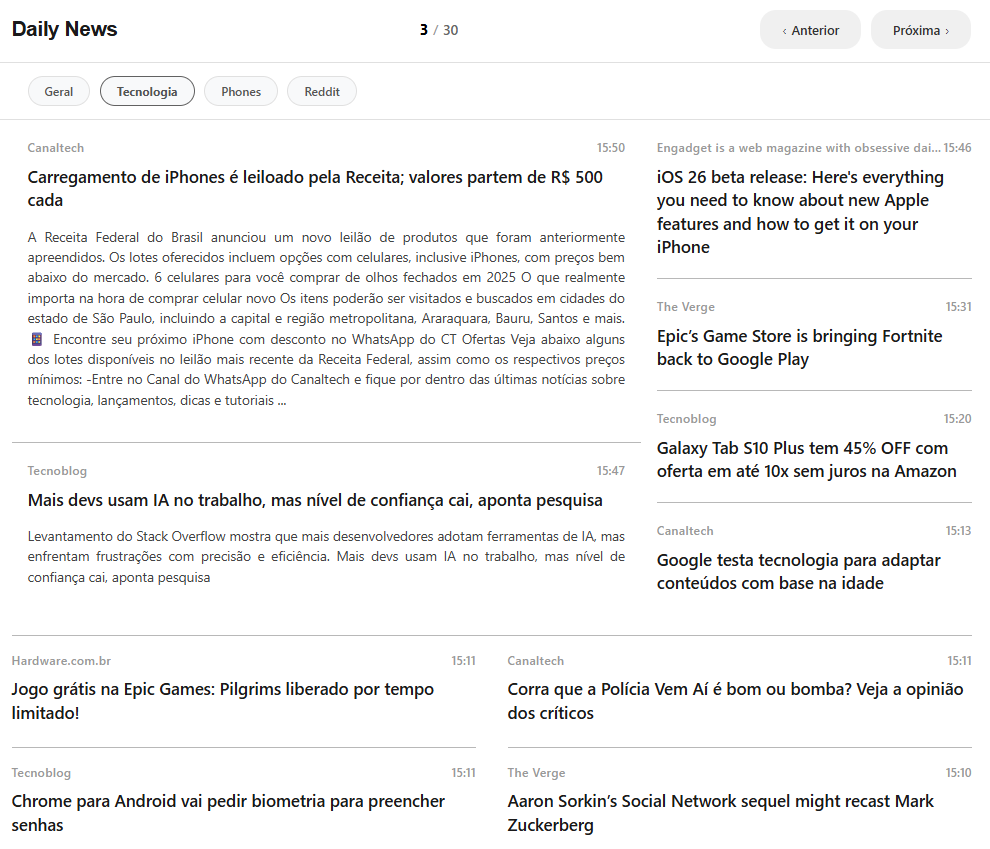
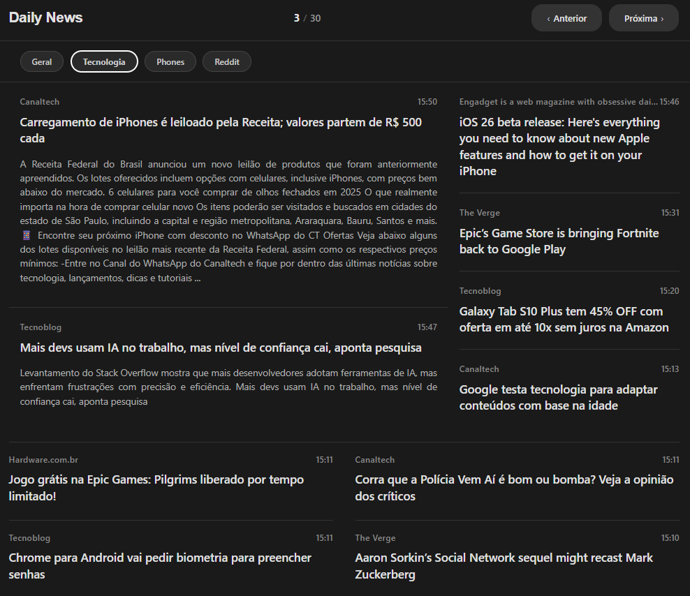

# 📰 Daily News - AI-Powered News Reader and RSS Aggregator


A blazing-fast news reader built with SvelteKit 2 + Svelte 5. It organizes multiple news sources—both traditional RSS feeds and regular websites without RSS support—into customizable categories with a clean, responsive interface. It offers a great reading experience across desktop, mobile, and even the experimental Kindle browser.

> **📚 Development Note**: A large portion of this project was developed using generative AI for code generation. However, due to the current limitations of generative tech, some core features and heavy-lifting were meticulously hand-crafted.

---

## 🤖 Why AI Makes Daily News Special

*Daily News isn't just another news app. Thanks to AI, you can follow news from ANY website, even if they explicitly don't offer an RSS feed! It features an embedded AI engine designed to supercharge your reading experience:*

- **✨ Smart Headline Extraction**: Want news from a site with no RSS feed? The built-in LLM plugin navigates homepages and intelligently extracts the latest headlines for you.
- **🌍 Auto-Translation & Noise Removal**: The AI seamlessly dives into full articles, stripping away annoying menus, pop-ups, and ads, delivering only the pure, translated news content right to your feed.
- **🧠 Intelligent Summarization**: Generates highly accurate and concise summaries natively from long-form content.
- **🔄 Seamless Integration**: AI-extracted and translated articles are beautifully interleaved with your standard RSS feeds, creating a perfectly unified news timeline.

---

## ✨ Core Features

- **🎯 Super Simple**: Designed to be extremely easy to install and run locally
- **📊 Multi-User Platform**: Support for multiple user profiles with independent configurations
- **📂 Categorization**: Organize your news feeds (RSS or AI-scraped) into fully customizable tabs
- **💾 No Database Needed**: Stores articles in static JSON files for maximum simplicity and portability
- **📱 Responsive Design**: Fully optimized UI for desktop, tablet, and mobile reading
- **🌙 Dark/Light Theme**: Cookie-based persistence with SSR rendering (zero theme flash)
- **⚡ Background Syncing**: Initial fetch on startup + automated background synchronization every 3 hours
- **👀 Feed Watcher**: Automatically reprocesses inputs whenever `.feeds` configuration files are updated
- **🎨 Clean UI**: A minimalistic interface inspired by modern premium news readers
- **🐳 Docker Ecosystem**: Simplified, painless deployment via containers

### Main Interface


### Dark Theme


## 🛠️ Tech Stack

- **Frontend**: SvelteKit 2.x, Svelte 5.x, TypeScript, Vite
- **Backend & AI**: Node.js, OpenRouter LLM Integrations, Puppeteer (Web Scraping), XML parsing, Cron jobs
- **Deployment**: Docker, Node.js adapter
- **Feeds**: Full RSS 2.0 and Atom 1.0 support

## 📋 Prerequisites

- Node.js 22+ (recommended) or Docker
- pnpm (recommended) or npm

## 🔧 Installation

> 💡 **Recommended**: Use the pre-built GHCR images detailed in the [Deploy](#-deploy) section for the fastest setup.

### Local Development

```bash
# Clone the repository
git clone https://github.com/marcelomartins/daily-news.git
cd daily-news

# Install dependencies
pnpm install

# Configure your RSS feeds (see strictly Configuration section)
cp data/exemplo.feeds data/your-username.feeds

# Start the dev server
pnpm dev

# App will be available at:
# http://localhost:8999
```

### Docker

```bash
# Build the image manually (after cloning)
docker build -t daily-news .

# Run the container
docker run -d \
  --name daily-news \
  -p 3000:3000 \
  -v $(pwd)/data:/app/data \
  daily-news
```

## ⚙️ Configuration

### Setting Up News Sources (RSS & Non-RSS)

Create a `.feeds` file inside the `data/` directory for each user profile. You can mix standard RSS URLs and regular website URLs (using flags for AI processing):

```bash
# data/username.feeds

[General]
https://g1.globo.com/rss/g1/brasil
https://g1.globo.com/rss/g1/mundo
https://folha.uol.com.br/rss/

[Technology]
https://www.theverge.com/rss/index.xml
https://tecnoblog.net/feed/
https://canaltech.com.br/rss/

[Reddit]
https://www.reddit.com/r/selfhosted.rss[new-tab]
https://www.reddit.com/r/technology.rss[new-tab]
https://www.reddit.com/r/programming.rss[new-tab]

[Headlines]
https://olhardigital.com.br[headline, new-tab, no-rss]
```

#### Feed Configuration Format

- `[Category]`: Defines a new category tab
- RSS URLs: One per line underneath the category
- `#`: Comments (line will be ignored)
- Optional flags at the end of the URL: `https://site.com/feed[headline, new-tab, no-rss]`

Available flags:

- `headline`: Activates the AI LLM Headlines Plugin for this source
- `new-tab`: Forces the original link to open in a new browser tab
- `no-rss`: Skips RSS fetching entirely. Use this when the URL is just a normal website homepage. The AI will instead navigate the site, read the HTML, and discover the news articles for you natively!

If no flags are provided, the URL will be treated as a standard RSS feed.

### AI Headlines Plugin Configuration (LLM)

To avoid free-tier limitations and leverage your custom limits safely, please configure your environment variables:

```bash
# mandatory for using OpenRouter
OPENROUTER_API_KEY=sk-or-v1-...

# optional: a dedicated key purely for the headlines plugin
HEADLINES_OPENROUTER_API_KEY=sk-or-v1-...

# highly recommended: stable non-free models
OPENROUTER_MODEL=openai/gpt-oss-20b

# optional: fallback cascade if the primary model fails
OPENROUTER_FALLBACK_MODELS=qwen/qwen3-next-80b-a3b-instruct:free,z-ai/glm-4.5-air:free

# optional: auto-retry mechanics for transient errors (429/5xx)
OPENROUTER_MAX_RETRIES=2
OPENROUTER_RETRY_DELAY_MS=1500

# plugin execution interval (e.g. 120 minutes)
HEADLINES_INTERVAL_MINUTES=120

# language the AI will translate full articles into (leave empty/omitted to keep original language)
TRANSLATION_TARGET_LANG=en-US
```

*Note: If you receive a "add your own key to accumulate your rate limits" error, ensure you have added your provider key directly inside `https://openrouter.ai/settings/integrations` (BYOK configuration via the OpenRouter dashboard).*

### Directory Structure

```text
data/
├── username.feeds                # User's feed configuration
└── pages/
    ├── username-General.json     # Consolidated main base items for category
    ├── username-Technology.json  # Consolidated main base items for category
    ├── username-General-headlines.json      # Optional cache layer for AI [headline] plugins
    ├── username-Technology-headlines.json   # Optional cache layer for AI [headline] plugins
    └── ...
```

> Pagination (`/[user]/[category]/[page]`) is handled natively in memory via the standard `user-Category.json` file.
> Meaning: The system no longer generates heavily fragmented `-1.json`, `-2.json` files per page.

## 🖥️ Usage

### Accessing the Application

1. Local Development environment: `http://localhost:8999`
2. Docker / Production environments: `http://localhost:3000` 
3. The server will auto-redirect you to `/username` (the first valid user profile detected)
4. Use the custom top navigation bar to move effortlessly between categories
5. Utilize the navigation buttons to iterate seamlessly reading pages

### Route Overview

- `/`: Redirects directly to the first available user
- `/[user]`: Redirects strictly to the user's first category
- `/[user]/[category]`: Redirects specifically to page 1
- `/[user]/[category]/[page]`: Targets a specific page number

## 📁 Source Code Structure

```text
src/
├── app.html                   # Base HTML template
├── hooks.server.ts            # Server-side hooks (handling themes + background jobs)
├── lib/
│   ├── components/
│   │   ├── Article.svelte     # Custom generic Article UI component
│   │   └── NavigationButtons.svelte 
│   └── server/
│       └── cron.js            # RSS fetchers, Atom parsers, pagination builders
└── routes/
    ├── +page.ts               # Root redirect mapping
    └── [user]/
        ├── +page.server.ts    # User validation logics
        └── [category]/
            └── [[page]]/
                ├── +page.server.ts  # Fetches and returns categorized news payload
                └── +page.svelte     # Front-stage rendering component
```

## 🚀 Deployment

### Automated Publish (GitHub Actions + GHCR)

This codebase continuously packages and pushes Docker images automatically securely via GitHub Actions.

- Setup location: `.github/workflows/docker-publish.yml`
- Multi-architecture builds supported: `linux/amd64` and `linux/arm64`
- Targeted Registry: GitHub Container Registry (`ghcr.io`)
- Image tag taxonomy: `ghcr.io/<owner>/daily-news`

#### Trigger Behaviors & Auto-tags

| Event Trigger | Resulting Tags Published |
|---------|-----------|
| `push` to `main` | publishes `latest`, `main` and `sha-<commit>` |
| `push` a tag `v*` | publishes `vX.Y.Z`, `X.Y` and `sha-<commit>` |
| `pull_request` against `main` | dry-run build validation check (no pushes) |
| `workflow_dispatch` | manual trigger options execution |

### Manual Deploy via Docker

#### Standard Raw Execution

```bash
# Uses the most freshly updated container version
docker run -d 
  --name daily-news 
  -p 3000:3000 
  -v $(pwd)/data:/app/data 
  -e NODE_ENV=production 
  ghcr.io/marcelomartins/daily-news:latest
```

#### Using Docker Compose (Highly Recommended)

```yaml
services:
  daily-news:
    image: ghcr.io/marcelomartins/daily-news:latest
    container_name: daily-news
    ports:
      - "1015:3000"
    volumes:
      - /home/your-user/daily-news:/app/data
    env_file:
      - .env
    restart: unless-stopped
```

> Pro-tip: Base your infra on the bundled `docker-compose.yml` and slightly alter port bindings or env vars for proper fit to your specific server topology.

## 🤝 Contributing

Contributions are always highly welcomed! Follow these minimal steps:

1. Fork this project directly
2. Slice out a new working branch (`git checkout -b feature/cutting-edge-idea`)
3. Lay down your solid commits (`git commit -m 'Added magic ✨'`)
4. Fire the branch to your origin (`git push origin feature/cutting-edge-idea`)
5. Easily pop open a Pull Request upstream

### Developer Helper Scripts

```bash
# Wire in the core local deps
pnpm install

# Run hot-refresh development
pnpm dev

# Perform TS and layout checks
pnpm check

# Statically bundle a production-ready footprint
pnpm build
```

## 📝 License

This application is safely open-sourced utilizing the permissive MIT License. Review the [LICENSE](LICENSE) file specifically for deeper details.

## 📊 Project Pulse 


---

⭐ If this architecture sparks any joy, highly consider throwing a shiny star up above!
